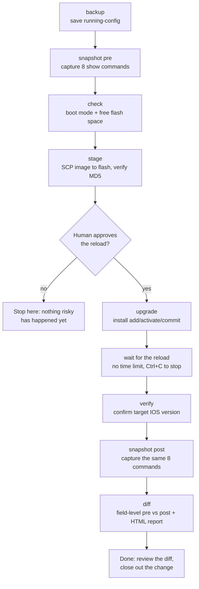
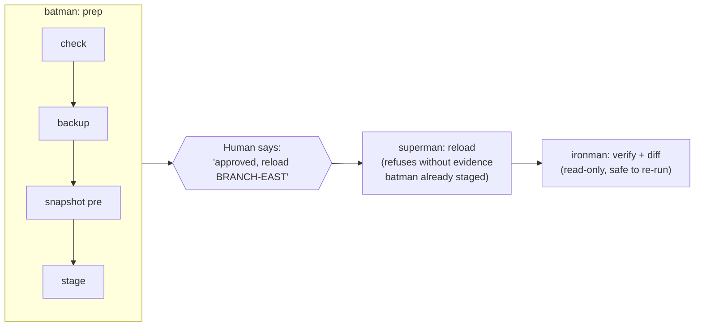

# Cisco Switch Fleet Upgrade Toolkit

Automates a Cisco IOS-XE switch upgrade end to end: pre-checks, backup,
snapshot, image staging, the reload itself, and post-upgrade verification.
It works one switch at a time, with a human-approval gate before anything reloads.

Built on [Nornir](https://nornir.readthedocs.io/) + [Netmiko](https://github.com/ktbyers/netmiko).
Tested against Cisco Catalyst 9200/9200L switches in both `install` mode
(`packages.conf`) and legacy `bundle` mode.

> All hostnames, IPs, and site names in this repo are dummy examples. Your
> real inventory (`inventory/hosts.yaml`) and credentials are gitignored.
> See [Setup](#setup).

## The flow



Every step except the reload itself is safe to re-run. The tooling refuses
to reload more than one host per invocation, and only after a human says go.

## Two ways to run it

### 1. One-shot CLI wrapper

```bash
./run-upgrade.sh BRANCH-EAST
```

This runs every stage for one switch and stops at the first failure. Each
stage is a single line that updates in place while it runs, then shows the
result and how long it took:

```
PLAY [BRANCH-EAST upgrade - 2026-10-05 19:02] ******************************
log: logs/upgrade-BRANCH-EAST-20261005-190211.log
[1/10] Decrypt credentials ........... ok (2s)
[2/10] Backup running-config ......... changed (14s)  812 lines saved to configs/BRANCH-EAST-2026-10-05.cfg
[3/10] Pre-upgrade snapshot .......... ok (41s)  8 commands saved
[4/10] Check boot mode / free space .. ok (3s)  install mode, 1.31 GB free (min 1.20)
[5/10] Stage image to flash .......... 63% (316/502 MB)  04:12
```

and when it finishes:

```
[5/10] Stage image to flash .......... changed (11m02s)  image transferred, MD5 OK
[6/10] Confirm reload ................
About to run install add/activate/commit and reload BRANCH-EAST now. This is the irreversible step.
Type the hostname exactly (BRANCH-EAST) to proceed, anything else aborts: BRANCH-EAST
[6/10] Confirm reload ................ ok (approved)
[7/10] Upgrade and reload ............ changed (2m05s)  install issued, switch will reload on its own
[8/10] Verify version ................ ok (18m52s)  running 17.18.04
[9/10] Post-upgrade snapshot ......... ok (40s)  8 commands saved
[10/10] Diff pre/post state .......... ok (0s)  report: reports/BRANCH-EAST-diff-20261005_190211.html

PLAY RECAP ****************************************
BRANCH-EAST    : ok=8   changed=3   failed=0
```

- **Full output is never lost.** Each stage's complete output (Nornir
  results, raw switch output, tracebacks) goes to the log file. If a stage
  fails, all of its output is also printed on screen under the `FAILED` line.
- **The confirm stage** is the human-approval gate from the diagram. It
  reads from the controlling terminal directly (not stdin), refuses to
  proceed if no terminal is attached, and anything but the exact hostname
  aborts before the reload.
- **The verify stage waits with no time limit.** `install add/activate`
  can take well over 15 minutes before the switch actually reloads, so it
  waits for the reload, then for ping and SSH to come back, then checks the
  version. Press Ctrl+C to stop waiting. That only stops the script; the
  install keeps running on the switch, and the script tells you what to
  check next.
- **When the run succeeds**, it serves `reports/` on port 8000 and prints
  the link using the server's IP address. Ctrl+C stops the server.

Environment switches:

| Variable | Effect |
|---|---|
| `VERBOSE=1` | Show every stage's full output live instead of the one-line display |
| `SKIP_CHECK=1` | Skip the free-space/boot-mode gate (see [gotchas](#fleet-gotchas-this-toolkit-already-works-around)) |
| `AUTO_APPROVE_RELOAD=1` | Skip the interactive confirm, for runs a human already approved out of band |
| `NO_SERVE=1` | Don't start the report web server at the end |

### 2. Claude Code agents

If you use [Claude Code](https://claude.com/claude-code), `.claude/agents/`
defines three agents that mirror the same flow, split at the
human-approval gate:



Ask Claude Code to run `batman` on a host, review its report, explicitly
approve the reload, then run `superman`, then `ironman` once the switch is
back. The agents call the same scripts as the CLI path. They add
guardrails: they refuse to skip steps, refuse to reload without explicit
approval, never touch credentials themselves, and stream full raw output.
`ironman` uses `verify --no-wait`, because the open-ended reload wait would
outlast an agent's command timeout.

Both paths call the same `upgrade.py` / `snapshot.py` / `backup_config.py`,
so use whichever fits your workflow.

## Setup

```bash
git clone <this-repo-url>
cd cisco-switch-fleet-upgrade
python3 -m venv venv
./venv/bin/pip install -r requirements.txt

cp inventory/hosts.yaml.example inventory/hosts.yaml
# edit inventory/hosts.yaml with your real switches
```

Always run the scripts with `./venv/bin/python3` (or an activated venv).
Plain `python3` fails immediately with `ModuleNotFoundError: No module named 'nornir'`.

Download your target IOS-XE image from [cisco.com](https://www.cisco.com/)
(needs a valid support contract/CCO login) and put the `.bin` file in
`images/` at the repo root. That directory is gitignored, so the image
never gets committed. Then fill in `inventory/defaults.yaml` with:
- the target version
- the image filename
- the MD5 Cisco publishes alongside the download
- the matching `local_image_path` (`images/<your-image-filename>`)
- your minimum free-flash requirement

### Switch-side prerequisites

Every switch needs these before `stage` can copy the image over SCP. They
are **not** pushed by the scripts, on purpose: `aaa new-model` changes how
every login is authorised, and getting it wrong can lock you out. Apply
them by hand, then `write memory`, **before** starting a run:

```
aaa new-model
aaa authorization exec default local
username <your-user> privilege 15 ...
```

Without them, SCP fails with `Privilege denied`. Cisco's SCP server does
its own exec-authorization check, and that check ignores privilege you
reached some other way at login (such as `enable`).

### Credentials

Never hardcoded, never committed. Two options:

- **Env vars** (simplest, good for CI, and the only option for
  `backup_config.py` / `push_snmp_config.py`, see the note below):
  ```bash
  export NET_USER=admin
  export NET_PASS='...'
  export NET_ENABLE='...'   # enable secret, separate from the login password
  ```
- **Encrypted local vault**, one-time setup:
  ```bash
  ./venv/bin/python3 encrypt_creds.py
  ```
  It prompts for your switch login username, login password, and enable
  secret, then a *separate* vault passphrase to encrypt them with. It
  writes the result to `credentials.enc` (mode 600, gitignored). After that,
  you just run the script and type the vault passphrase when prompted:
  ```
  $ ./venv/bin/python3 upgrade.py check
  Vault passphrase:
  ```
  The passphrase itself is never stored anywhere. If you lose it, re-run
  `encrypt_creds.py` to set new credentials.

  **Only `upgrade.py` and `snapshot.py` fall back to the vault.** They
  check env vars first and read `credentials.enc` if those aren't set.
  `backup_config.py` and `push_snmp_config.py` require
  `NET_USER`/`NET_PASS`/`NET_ENABLE` to be exported and exit with a clear
  error otherwise. For vault support everywhere, point their
  `load_inventory()` at `creds.load_credentials()` the same way
  `upgrade.py` does.

The `run-*.sh` wrappers and `post-verify.sh` pull credentials from a
host-bound [`systemd-creds`](https://www.freedesktop.org/software/systemd/man/latest/systemd-creds.html)
vault (`creds/*.cred`) via `sudo systemd-creds decrypt`, so expect a sudo
password prompt at the start of each run. Swap that for whatever secrets
manager you already use.

## Usage: phase by phase

```bash
./venv/bin/python3 upgrade.py check                      # boot mode + free space, all hosts
./venv/bin/python3 upgrade.py stage --host BRANCH-EAST   # copy image to flash, verify MD5
./venv/bin/python3 upgrade.py upgrade --host BRANCH-EAST # reload ONE host, refuses to run without --host
./venv/bin/python3 upgrade.py verify --host BRANCH-EAST  # waits for the reload (no limit, Ctrl+C to stop), then checks
./venv/bin/python3 upgrade.py verify --host BRANCH-EAST --no-wait  # switch already back: check right away
```

```bash
./venv/bin/python3 backup_config.py --host BRANCH-EAST
./venv/bin/python3 snapshot.py capture --host BRANCH-EAST --label pre
./venv/bin/python3 snapshot.py capture --host BRANCH-EAST --label post
./venv/bin/python3 snapshot.py diff --host BRANCH-EAST --html reports/BRANCH-EAST.html
```

### Finishing a run by hand: `post-verify.sh`

If a run stops after the reload was issued (you pressed Ctrl+C during the
wait, your SSH session dropped, or you ran the upgrade manually), wait until
the switch is back up, then:

```bash
./post-verify.sh BRANCH-EAST
```

It checks the version straight away, takes the post-upgrade snapshot,
writes the diff report, and serves it on port 8000. It is entirely
read-only against the switch and safe to re-run.

### If your SSH session drops mid-upgrade

Every `run-upgrade.sh` run writes the full output of every stage to
`logs/upgrade-<HOST>-<timestamp>.log`. Reconnect and follow it (the `sed`
strips colour codes):

```bash
tail -f logs/upgrade-<HOST>-<timestamp>.log | sed 's/\x1b\[[0-9;]*m//g'
```

Find the newest log with `ls -t logs/ | head`. A dropped terminal can still
send the script a hangup signal, so for long runs start `run-upgrade.sh`
inside `tmux` or `screen` in the first place.

### SNMP rollout (optional, separate from the upgrade flow)

`push_snmp_config.py` pushes read-only SNMPv3 monitoring config fleet-wide.
It auto-selects SHA-2/AES-256 or SHA-1/AES-128 per host, based on the
firmware each one is already running (see the file's docstring for why).

```bash
export SNMP_AUTH_PASS='...'
export SNMP_PRIV_PASS='...'
./run-push-snmp.sh
```

## Fleet gotchas this toolkit already works around

Learned from running this against a real fleet, and kept here so nobody
has to rediscover them:

**Staging the image**
- **SCP must be enabled** (`ip scp server enable`) before `stage` can
  transfer the image. Handled automatically.
- **SCP also needs AAA exec authorization and `privilege 15`.** Not
  automated; see [Switch-side prerequisites](#switch-side-prerequisites).
- **exec-timeout kills the control channel mid-transfer.** The transfer
  runs on its own SCP channel, but the main SSH session sits idle the whole
  time and is reused for the MD5 check afterwards. Over a slow WAN link a
  502 MB image has taken 78 minutes. `stage` pushes `exec-timeout 120 0` on
  the vty lines first. It is not `0 0` (never), because the upgrade
  step's `write memory` saves it permanently.
- **Don't stage several slow sites at once.** Parallel transfers share the
  same WAN bandwidth and all slow down.
- **Re-running `stage` after a failed MD5 check is cheap.** The image is
  never overwritten. If it is already on flash, Netmiko just checks its MD5
  and skips the transfer. If that copy is corrupt, delete it from flash first.
- **Lite (9200L) flash is tight.** About 1.8-1.9 GB total, with the
  running image and the new one both taking ~500 MB. The `check` stage's
  `min_free_bytes` can fail switches where `install add` would actually
  fit. `install add` does its own space check, so `SKIP_CHECK=1` is a
  reasonable override once you've looked at the numbers.
- **Don't run `install remove inactive` after staging.** It doesn't
  distinguish old packages from the newly staged target image, and it has
  deleted the target image. It is only safe *before* staging.

**Installing and reloading**
- **`install add` refuses to run if running-config != startup-config**
  ("System configuration has been modified"). `upgrade_install_mode` runs
  `write memory` first, and it also fails the stage, with the switch's
  output shown, if the install reports `FAILED` instead of reloading.
- **`install add` is issued with `prompt-level none`**, which suppresses
  every interactive prompt, including "This will reload the system,
  proceed? [confirm]". That's the only way to run add/activate/commit in
  one shot. Because of this, there is no prompt text to wait for: the
  command is expected to time out on the client side after 120s while the
  install carries on running on the switch.
- **The reload drops your SSH session. That's expected, not a failure.**
  Nornir's `task.run()` records a subtask's result *before* raising, so
  even a caught exception leaves a failed entry behind. Both install and
  bundle mode talk to the Netmiko connection directly for that one command,
  so the expected disconnect is never reported as a failure.
- **Don't retry `upgrade` (or `install add`/`install abort`) right after
  a timeout.** The first install is almost certainly still running on the
  switch, and a retry fails with "some operation is already running" or
  "Super package already added". Check `show install summary` /
  `show install log` first.

**Waiting and verifying**
- **A single lost ping is not a reload.** The CPU is busy during
  `install add/activate` and can drop the odd ping. The wait only counts
  the switch as down after 30 seconds of continuous ping loss, and prints
  shorter blips as it goes.
- **"Back online" means SSH, not just ping.** SSH comes up a little after
  ping does. The wait checks for an SSH banner on port 22, then allows 60s
  to settle before logging in.
- **Open the verify SSH session *after* the reload.** A session opened
  before the wait dies with the reload, and Nornir would happily reuse it.

**Netmiko settings**
- **Don't set `read_timeout_override`.** In Netmiko 4.x it silently
  replaces *every* per-command `read_timeout`, including the MD5 verify's
  180s, the install's 120s, and the backup's 120s. Each call sets its own
  timeout instead.

## Repo layout

```
upgrade.py                  check / stage / upgrade / verify phases
backup_config.py            running-config backup, one file per host
snapshot.py                 pre/post `show` command capture, field-level diff, HTML report
run-upgrade.sh              one-shot wrapper: full flow for one host, condensed display
taskui.py, progress.py      run-upgrade.sh's one-line-per-stage display
post-verify.sh              finish a run by hand: verify + post snapshot + diff + report
push_snmp_config.py         optional SNMPv3 read-only monitoring rollout
creds.py, encrypt_creds.py  local encrypted credential vault
run-backup.sh, run-push-snmp.sh   thin wrappers around the above
inventory/                  Nornir inventory (hosts.yaml is yours, gitignored)
.claude/agents/             batman / superman / ironman Claude Code agents
```
