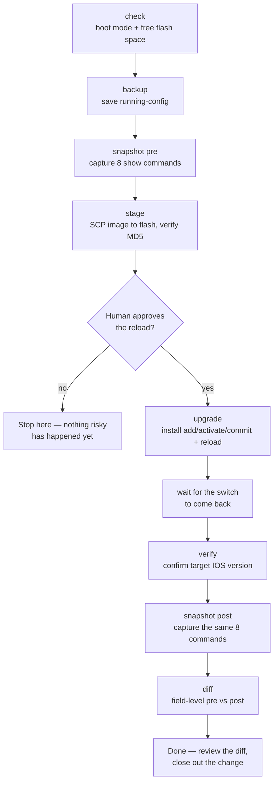

# Cisco Switch Fleet Upgrade Toolkit

Automates a Cisco IOS-XE switch upgrade end to end — pre-checks, backup,
snapshot, image staging, the reload itself, and post-upgrade verification —
one switch at a time, with a human-approval gate before anything reloads.

Built on [Nornir](https://nornir.readthedocs.io/) + [Netmiko](https://github.com/ktbyers/netmiko).
Tested against Cisco Catalyst 9000-series switches in both `install` mode
(`packages.conf`) and legacy `bundle` mode.

> All hostnames, IPs, and site names in this repo are dummy examples. Your
> real inventory (`inventory/hosts.yaml`) and credentials are gitignored —
> see [Setup](#setup).

## The flow



Every step but the reload itself is safe to re-run. Only one switch reloads
at a time, and only after a human says go — the tooling refuses to reload
more than one host per invocation.

## Two ways to run it

**1. Plain CLI** — works anywhere, no dependencies beyond the venv:

```bash
./run-upgrade.sh BRANCH-EAST
```

This chains check → backup → pre-snapshot → stage → **confirm** → upgrade →
verify → post-snapshot → diff, Ansible-style TASK/PLAY output, and stops at
the first failure (see `run-upgrade.sh`). The confirm step is the
human-approval gate from the diagram above — it shows the staging result,
then makes you type the hostname back to proceed:
```
TASK [Confirm reload] ******************************************
About to run install add/activate/commit and reload BRANCH-EAST now. This is the irreversible step.
Type the hostname exactly (BRANCH-EAST) to proceed, anything else aborts:
```
It reads from the controlling terminal directly (not stdin), refuses to
proceed if it can't reach one at all, and typing anything but the exact
hostname aborts before the reload. For scripted/CI runs where a human
already approved out of band, set `AUTO_APPROVE_RELOAD=1` to skip it.

**2. Claude Code agents** — if you use [Claude Code](https://claude.com/claude-code),
`.claude/agents/` defines three agents that mirror the same flow, split at
the human-approval gate:


Ask Claude Code to run `batman` on a host, review its report, explicitly
approve the reload, then `superman`, then `ironman`. Same underlying
scripts as the CLI path — the agents just add guardrails (refuse to skip
steps, refuse to reload without explicit approval, never touch credentials
themselves) and stream full raw output instead of summarizing it.

Use whichever fits your workflow — they're not mutually exclusive, and both
end up calling the same `upgrade.py` / `snapshot.py` / `backup_config.py`.

## Setup

```bash
git clone <this-repo-url>
cd cisco-switch-fleet-upgrade
python3 -m venv venv
./venv/bin/pip install -r requirements.txt

cp inventory/hosts.yaml.example inventory/hosts.yaml
# edit inventory/hosts.yaml with your real switches
```

Fill in `inventory/defaults.yaml` with your target image (filename, MD5,
local path) and minimum free-flash requirement.

### Credentials

Never hardcoded, never committed. Two options:

- **Env vars** (simplest, good for CI, and the only option for
  `backup_config.py` / `push_snmp_config.py` — see note below):
  ```bash
  export NET_USER=admin
  export NET_PASS='...'
  export NET_ENABLE='...'   # enable secret, separate from the login password
  ```
- **Encrypted local vault** — one-time setup:
  ```bash
  ./venv/bin/python3 encrypt_creds.py
  ```
  It prompts for your switch login username, login password, and enable
  secret, then a *separate* vault passphrase to encrypt them with, and
  writes the result to `credentials.enc` (mode 600, gitignored). From then
  on, instead of exporting `NET_USER`/`NET_PASS`/`NET_ENABLE`, you just run
  the script and type the vault passphrase when prompted:
  ```
  $ ./venv/bin/python3 upgrade.py check
  Vault passphrase:
  ```
  The passphrase itself is never stored anywhere — lose it and you re-run
  `encrypt_creds.py` to set new credentials.

  **Only `upgrade.py` and `snapshot.py` fall back to the vault** — they
  check env vars first, and read `credentials.enc` if those aren't set.
  `backup_config.py` and `push_snmp_config.py` have their own credential
  loading and currently require `NET_USER`/`NET_PASS`/`NET_ENABLE` to be
  exported; they'll exit with a clear error if the vault is the only thing
  you've set up. If you want vault support everywhere, point their
  `load_inventory()` at `creds.load_credentials()` the same way
  `upgrade.py` does.

The `run-*.sh` wrappers additionally show a pattern for pulling credentials
from a host-bound [`systemd-creds`](https://www.freedesktop.org/software/systemd/man/latest/systemd-creds.html)
vault (`creds/*.cred`) via `sudo systemd-creds decrypt` — swap that for
whatever secrets manager you already use.

## Usage — phase by phase

```bash
./venv/bin/python3 upgrade.py check                    # boot mode + free space, all hosts
./venv/bin/python3 upgrade.py stage                     # copy image to flash, verify MD5
./venv/bin/python3 upgrade.py upgrade --host BRANCH-EAST # reload ONE host — refuses to run without --host
./venv/bin/python3 upgrade.py verify --host BRANCH-EAST --wait 300
```

```bash
./venv/bin/python3 backup_config.py --host BRANCH-EAST
./venv/bin/python3 snapshot.py capture --host BRANCH-EAST --label pre
./venv/bin/python3 snapshot.py capture --host BRANCH-EAST --label post
./venv/bin/python3 snapshot.py diff --host BRANCH-EAST     # colored, field-level, TextFSM-parsed
```

Or the one-shot wrapper for a single switch, start to finish:

```bash
./run-upgrade.sh BRANCH-EAST
```

### SNMP rollout (optional, separate from the upgrade flow)

`push_snmp_config.py` pushes read-only SNMPv3 monitoring config fleet-wide,
auto-selecting SHA-2/AES-256 vs SHA-1/AES-128 per host based on which
firmware they're already running (see the file's docstring for why).

```bash
export SNMP_AUTH_PASS='...'
export SNMP_PRIV_PASS='...'
./run-push-snmp.sh
```

## Fleet gotchas this toolkit already works around

Hard-won from running this against a real fleet — kept here so nobody
rediscovers them the slow way:

- **SCP must be enabled** (`ip scp server enable`) before `stage` can
  transfer the image — handled automatically.
- **exec-timeout kills the control channel mid-transfer.** A multi-hundred-MB
  SCP transfer can outlast IOS's default 10-minute exec-timeout on the vty
  lines used for the *control* session (the transfer itself runs on its own
  channel) — `stage` pushes a longer exec-timeout first.
- **`install add` refuses to run if running-config != startup-config.**
  `upgrade_install_mode` runs `write memory` first for exactly this reason.
- **`install add` is issued with `prompt-level none`** (`install add file
  flash:<image> activate commit prompt-level none`), which suppresses every
  interactive prompt IOS-XE would otherwise show — including "This will
  reload the system, proceed? [confirm]". That's deliberate: it's the only
  way to run `install add/activate/commit` unattended in one shot. One
  side effect worth knowing — because that prompt never appears, there is
  no "confirm" text to wait on, so `upgrade_install_mode` doesn't (and
  can't) use an `expect_string` the way bundle mode's plain `reload` does.
- **The reload drops your SSH session — that's expected, not a failure.**
  `install add/activate/commit` (and a bundle-mode `reload`) legitimately
  kill the session before the switch finishes rebooting. Routing that
  specific command through Nornir's normal `task.run()` subtask wrapper
  causes a false failure: `task.run()` records the subtask's result *before*
  raising, so even a caught, handled exception leaves a failed entry behind
  and the whole run reports failed. Both `upgrade_install_mode` and
  `upgrade_bundle_mode` instead talk to the Netmiko connection directly for
  that one command, so an expected disconnect never gets misreported as a
  hard failure.
- **Don't run `install remove inactive` right after staging** — on this
  fleet it has deleted the newly-staged *target* image instead of old
  cruft when run post-stage, pre-reload.
- **Don't retry a failed/timed-out `install add` immediately** — a second
  attempt before clearing a stuck first one can fail with `Super package
  already added. Add operation not allowed.` Investigate before retrying.
- **Only one host reloads per invocation, ever** — even in a batch, reloads
  happen one at a time with separate human approval each time.

## Repo layout

```
upgrade.py              check / stage / upgrade / verify phases
backup_config.py         running-config backup, one file per host
snapshot.py               pre/post `show` command capture + field-level diff
push_snmp_config.py       optional SNMPv3 read-only monitoring rollout
creds.py, encrypt_creds.py  local encrypted credential vault
run-upgrade.sh             one-shot CLI wrapper: full flow for one host
run-backup.sh, run-push-snmp.sh, post-verify.sh   thin wrappers around the above
inventory/                 Nornir inventory (hosts.yaml is yours, gitignored)
.claude/agents/            batman / superman / ironman Claude Code agents
```
